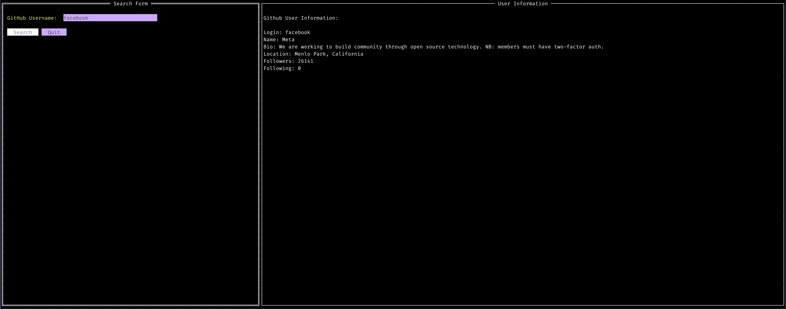

## Criando um App CLI Interativo com Go para Buscar Usuários do GitHub

Hoje vamos aprender como criar uma aplicação de linha de comando interativa usando Go! 🎉 Vamos construir uma interface que busca dados de usuários do GitHub e exibe as informações diretamente no terminal. Além disso, vamos aprender a configurar o ambiente do projeto, usar a biblioteca `tview` para a interface e `resty` para as requisições HTTP.

## Screenshot



### Passo 1: Configurando o Projeto

1. **Crie uma pasta para o projeto**:
   Abra o terminal e crie uma nova pasta para o projeto:

   ```bash
   mkdir github-cli
   cd github-cli
   ```

2. **Inicialize o Módulo Go**:
   Em seguida, inicialize o projeto como um módulo Go. Isso ajuda a gerenciar as dependências e versões das bibliotecas usadas:

   ```bash
   go mod init github.com/seu-usuario/github-cli
   ```

   Isso cria um arquivo `go.mod`, que registra as dependências do projeto.

3. **Configure o Git**:
   Se você quiser versionar seu código, inicialize o repositório Git:

   ```bash
   git init
   ```

4. **Instale as dependências**:
   Vamos instalar as bibliotecas que usaremos no projeto. No caso, `tview` para a interface e `resty` para fazer requisições HTTP:

   ```bash
   go get github.com/gdamore/tcell/v2
   go get github.com/go-resty/resty/v2
   go get github.com/rivo/tview
   ```

---

### Passo 2: Criando a Estrutura do Projeto

#### Estrutura de Diretórios

Aqui está uma sugestão de estrutura para o projeto:

```
github-cli/
│
├── go.mod
└── main.go
```

O arquivo principal será `main.go`, onde colocaremos todo o código da aplicação.

---

### Passo 3: Criando a Aplicação Go

Vamos criar um app CLI que permite o usuário digitar o nome de um usuário do GitHub, buscar suas informações e exibi-las no terminal.

1. **Importando as Bibliotecas**

Começamos importando as bibliotecas necessárias no nosso código:

```go
import (
  "encoding/json"
  "fmt"
  "github.com/gdamore/tcell/v2"
  "github.com/go-resty/resty/v2"
  "github.com/rivo/tview"
)
```

- **resty**: Uma biblioteca para facilitar requisições HTTP.
- **tview**: Usada para construir a interface de usuário no terminal.
- **tcell**: Responsável por capturar eventos do teclado e gerenciamento de terminais.

2. **Estrutura do Usuário do GitHub**

Agora, vamos definir uma estrutura `GitHubUser` para armazenar os dados do usuário do GitHub, que serão retornados pela API.

```go
type GitHubUser struct {
  Login     string `json:"login"`
  Name      string `json:"name"`
  Bio       string `json:"bio"`
  Location  string `json:"location"`
  Followers int    `json:"followers"`
  Following int    `json:"following"`
}
```

Essa estrutura será preenchida com os dados que buscamos da API do GitHub. Cada campo usa tags `json` para indicar quais propriedades da API queremos mapear.

---

### Passo 4: Inicializando a Aplicação

Agora vamos criar uma função `NewApp` que inicializa a aplicação. Ela vai configurar o cliente HTTP (`resty`) e a aplicação `tview`.

```go
type App struct {
    client     *resty.Client
    app        *tview.Application
    form       *tview.Form
    textView   *tview.TextView
    inputField *tview.InputField
}

func NewApp() *App {
    return &App{
        client: resty.New(),
        app:    tview.NewApplication(),
    }
}
```

Aqui, definimos nossa estrutura principal `App`, que mantém o cliente HTTP (`client`) e os componentes da interface (como o formulário `form` e a caixa de texto `textView`). A função `NewApp` cria uma nova instância dessa estrutura.

---

### Passo 5: Buscando Dados do GitHub

A função `fetchGitHubUser` é responsável por realizar uma requisição à API do GitHub e trazer os dados de um usuário. Ela utiliza a biblioteca `resty` para realizar a requisição HTTP e faz o parsing dos dados retornados para a estrutura `GitHubUser`.

```go
func (a *App) fetchGitHubUser(username string) (*GitHubUser, error) {
    url := fmt.Sprintf("https://api.github.com/users/%s", username)
    var user GitHubUser
    resp, err := a.client.R().Get(url)
    if err != nil {
        return nil, err
    }
    if err := json.Unmarshal(resp.Body(), &user); err != nil {
        return nil, err
    }
    return &user, nil
}
```

Essa função:
- Constrói a URL da API com base no nome de usuário fornecido.
- Faz uma requisição GET usando o `resty`.
- Faz o **unmarshal** dos dados JSON da resposta para a estrutura `GitHubUser`.

---

### Passo 6: Criando a Interface com `tview`

Agora vamos montar a interface do usuário. Vamos criar um formulário (`form`) onde o usuário poderá digitar o nome do usuário do GitHub e, ao submeter, veremos os resultados na `textView`.

#### O Que é o `tview`?

O `tview` é uma poderosa biblioteca para construir interfaces de texto no terminal. Ele nos permite criar componentes como formulários, caixas de texto, tabelas e layouts flexíveis.

#### Configurando o Formulário e a Caixa de Texto

```go
func (a *App) setupUI() {
  a.form = tview.NewForm()
  a.inputField = tview.NewInputField().
    SetLabel("GitHub Username: ").
    SetFieldWidth(30)

  a.form.AddFormItem(a.inputField)
  a.form.AddButton("Search", func() {
    username := a.inputField.GetText()
    user, err := a.fetchGitHubUser(username)
    if err != nil {
      a.textView.SetText(fmt.Sprintf("Error: %v", err))
      return
    }
    a.updateUserInfo(user)
  })
  a.form.AddButton("Quit", func() {
    a.app.Stop()
  })

  a.textView = tview.NewTextView().
    SetDynamicColors(true).
    SetRegions(true).
    SetWordWrap(true)

  flex := tview.NewFlex().
    AddItem(a.form, 0, 1, true).
    AddItem(a.textView, 0, 2, false)

  a.app.SetRoot(flex, true)
}
```

Aqui:
- **Formulário**: Um campo de entrada (`InputField`) permite que o usuário insira o nome de usuário do GitHub.
- **Botão de Busca**: Quando pressionado, ele chama a função `fetchGitHubUser` para buscar os dados do usuário.
- **Botão de Sair**: Encerra a aplicação.
- **Caixa de Texto**: Exibe as informações do usuário.

---

### Passo 7: Executando a Aplicação

Agora, basta rodar a função principal para colocar a aplicação no ar:

```go
func main() {
    app := NewApp()
    if err := app.Run(); err != nil {
        fmt.Printf("Error running application: %v\n", err)
    }
}
```

A função `Run` roda o loop de eventos da aplicação `tview`, que é responsável por manter a interface em execução.

---

### Conclusão

Neste tutorial, criamos uma aplicação CLI interativa que permite buscar informações de um usuário do GitHub. Usamos Go, `resty` para as requisições HTTP e `tview` para construir uma interface de terminal rica. 🚀

O que você acha de adicionar novas funcionalidades? Por exemplo, buscar repositórios do usuário ou exibir eventos recentes? 🤔 Comente suas ideias!


